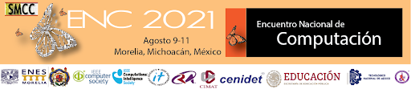
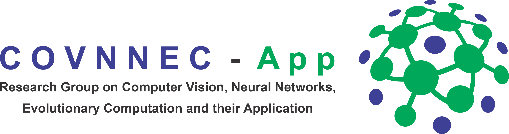
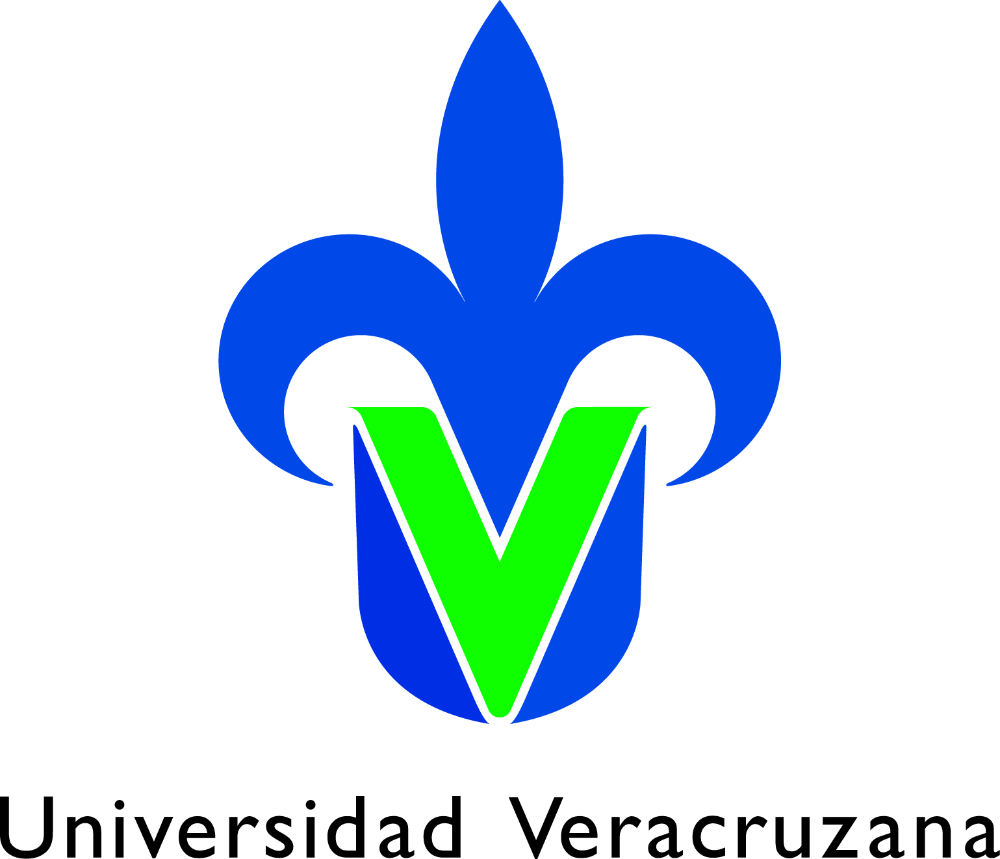

# **Tutorial de Neuroevolución**

Contenido del Tutorial de Neuroevolución del Encuentro Nacional de Computación (ENC) 2021

              

## **Impartido por:**

* Dr. Héctor Gabriel Acosta Mesa
* Dr. Efrén Mezura Montes
* Mtra. Rocío Erandi Barrientos Martínez
* Lic. José Clemente Hernández Hernández
* Ing. Juan Antonio Rodríguez de la Cruz
* Mtro. Gustavo Adolfo Vargas Hákim

Miembros del grupo **Research Group on Computer Vision, Neural Networks, Evolutionary Computation, and their Applications** (COVNNEC-App) del Instituto de Investigaciones en Inteligencia Artificial (IIIA) de la Universidad Veracruzana (UV).

## **Contenido del Tutorial**

1. Inteligencia Artificial
2. Inteligencia Computacional
3. Aprendizaje Automático
4. Redes Neuronales Convolucionales
  4.1 Implementación de Redes Neuronales Convolucionales 
5. Computación Evolutiva
6. Neuroevolución
  a. Introducción  
  b. Tipos  
  c. Representaciones  
  d. Profundidad de las arquitecturas  
  e. Ambientes de desarrollo  
  f. Futuro del área  
7. Aplicaciones
  a. Análisis de sentimientos en tweets representados con Word2Vec  
  b. Identificación de COVID-19 a partir de imágenes de rayos X de pulmón  
  c. Generación de imágenes sintéticas utilizando Redes Generativas Adversarias Convolucionales (DCGANs)  

## **Requerimientos de cómputo**

* Computadora con acceso a internet
* Cuenta en Google para acceder a Google Colab

## **Conocimientos deseables**

* Probabilidad y estadística
* Álgebra lineal
* Cálculo diferencial
* Fundamentos de programación
* Preferentemente, haber asistido al tutorial de Inteligencia Computacional
